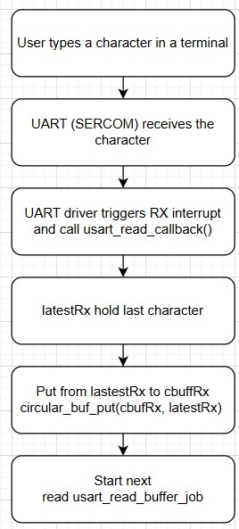
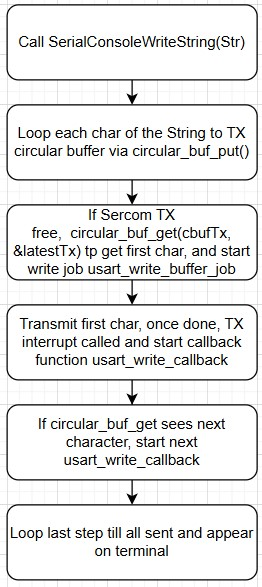

# a07g-exploring-the-CLI

* Team Number: 12
* Team Name: Dogwatch (formerly Andrew and Kiet)
* Team Members: Andrew Katz, Kiet Cao
* GitHub Repository URL: https://github.com/ese5160/final-project-a07g-a14g-t12-andrew-and-kiet
* Description of test hardware: (development boards, sensors, actuators, laptop + OS, etc)

# 1. **Software Architecture**

## Task List (SAMW25)

* CLI:

  * Priority: 1-2?
  * Run continuously/when UART received
* Dog Request Button, User Button

  * Priority: 4 Medium High
  * Trigger: GPIO Interrupt
  * Send the trigger to queue
  * If valid and not repeated (spam last 30 minutes), start task to Feed and task to send alert to IoT platform
* LED Fading/Status

  * Priority: 1
  * Receive message from other tasks via LED queue, maybe can read global var from mutex periodically
* **Wi-Fi/MQTT**

  * Priority: 5 High
  * Trigger: Always connected, boot at start and reboot if failed connection; wake up if need to send message or received message
  * Maintain queues to receive data from IoT or Feeding task, and can send command to IoT, Feeding task, AV.
  * Access to mutex, peridic update of global variables to send to platform?
* RTC task?

  * Priority: 3?
  * Set RTC for timed task initiations
  * Enables/disables tasks based on RTC
* SHT4 Temp/humidity (ref) reading

  * Priority: 1-2
  * Trigger: periodic
  * Send via queue/buffer to IoT task
* **Feed Task**

  * Priority: 5
  * Trigger: Button press, MQTT task command, periodic trigger (RTC)?
  * Coordinate all tasks to feed the dog: Motor task -> till index back, digital sensor trips or timeout -> Start light sensor array and ADC read task -> Log events and send to IoT task
* Motor Task

  * Priority: 4
  * Run food motor until return to index position
  * Run water motor until digital level sensor trips or safety timeout
* ADC Async Task? - Read water level before and after water bowl

  * Priority: 3
* Light Sensor Array

  * Priority: 3
  * Get reference light level
  * If too low, turn on lamp to preset brightness
  * Read 8 sensors via mux
  * Calculate food level
  * Report

**IoT Task**

* Priority: 4
* Triggers: Periodic update ( 30-60 mins), events: tilt, feed, distance
* Gather messages from Periodic Tasks, Feed Task, AV Task
* Sends compiled data to Wi-Fi/MQTT Task for upload.
* Uses queue to collect events, mutex-protected shared data for logs.

**Periodic Sensor Tasks**

* Accelerometer Task

  * Priority: 1
  * Init accelerometer
  * Setup interrupt
  * If interrupt fires, send to IoT task
* HDC3022

  * Priority: 1
  * Temp/humidity food reading
  * Periodic update to IoT task
* Tamper Switch

  * Priority: 1
  * Trigger: inerrupt
  * Add owner detect or something (key bypass?)
  * After refill, trigger light sensor array task to re-measure food
  * If tamper switch activates otherwise, then send alert.
  * Alternate: Use thumb screws so dog cannot get in, use tamper switch as trigger for re-measure food

* **Distance Sensor task**

  * Priority: 3
  * Trigger: Command from MQTT, after Feed task?
  * Initialize distance sensor
  * Read distance
  * Interrupt pin checks
  * Init AV Board camera trigger, possibly light trigger
* AV Board Communication (triggered task?)

  * Priority: 3
  * Trigger: Distance sensor task
  * Send UART trigger to RP board

## RP2040 Tasks (Round robin?)

* Wait for UART Triggers
* Get reference light measurement
* Take snapshot, upload to cloud
* LED Control
* Play Audio

#### 1. **Hardware and Software Requirements Specification**

#### 2. Block Diagram

### 3. Flowchart

# 2. **Understanding the Starter Code**

**Answer the following questions:

1. What does “InitializeSerialConsole()” do? In said function, what is “cbufRx” and “cbufTx”? What type of data structure is it?
   InitializeSerialConsole():

   * Initializes circular buffers `cbufRx` and `cbufTx` for RX and TX using `circular_buf_init()`.
   * Configures the UART (SERCOM) to 115200 baud and enable UART instance.
   * Sets up `usart_read_callback()` and `usart_write_callback()` to handle asynchronous read/write.
   * Set the interrupt priority of the SERCOM used for UART to SERCOM 4.
   * Starts the first non-blocking UART read.

   cbuf_handle_t cbufRx is Circular buffer handler for receiving characters.
   cbuf_handle_t cbufTx is Circular buffer handler for transmitting characters.

   It points to the circular buffer cbuf (fixed size array) with functions such as size, free, put, get.
2. How are “cbufRx” and “cbufTx” initialized? Where is the library that defines them (please list the *C file they come from).

   circular_buf_init()  returns a cbuf_handle_t, which is a pointer to a dynamically allocated circular_buf_t structure with size and buffer defined.

   These handles (cbufRx, cbufTx) are then used to interact with the buffer through the circular buffer API.

   They come from the circular_buffer.c file
3. Where are the character arrays where the RX and TX characters are being stored at the end? Please mention their name and size.

   1. Tip: Please note cBufRx and cBufTx are structures.
      The character data is actually stored in rxCharacterBuffer[RX_BUFFER_SIZE] and  txCharacterBuffer[TX_BUFFER_SIZE] with size defined to be 512 for both
4. Where are the interrupts for UART character received and UART character sent defined?

   The UART character received and sent interrupts are set up in `configure_usart_callbacks()` function. The `usart_read_callback()` is registered and enabled for `USART_CALLBACK_BUFFER_RECEIVED`. Similarly, `usart_write_callback()` is registered and enabled for `USART_CALLBACK_BUFFER_TRANSMITTED`.
5. What are the callback functions that are called when:
6. A character is received? (RX)

   usart_read_callback()
7. A character has been sent? (TX)

   usart_write_callback()
8. Explain what is being done on each of these two callbacks and how they relate to the cbufRx and cbufTx buffers.

   usart_read_callback(): once the system finishes receives all the bytes requested from a UART read job, put the character from lastestRx to rxCharacterBuffer, and start new read job.

   usart_write_callback(): Gets the next character from `cbufTx` using `circular_buf_get()` and if still need to write then starts a new write job.
9. Draw a diagram that explains the program flow for UART receive – starting with the user typing a character and ending with how that characters ends up in the circular buffer “cbufRx”. Please make reference to specific functions in the starter code.

10. Draw a diagram that explains the program flow for the UART transmission – starting from a string added by the program to the circular buffer “cbufTx” and ending on characters being shown on the screen of a PC (On Teraterm, for example). Please make reference to specific functions in the starter code.

11. What is done on the function “startStasks()” in main.c? How many threads are started?
Prints available heap size before start, then create the CLI task/thread, and print heap size after the CLI created.
One thread (CLI) currently.

**
