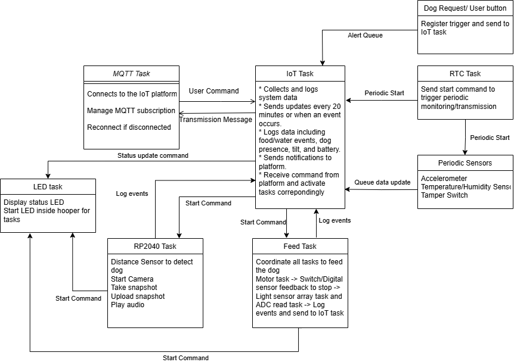
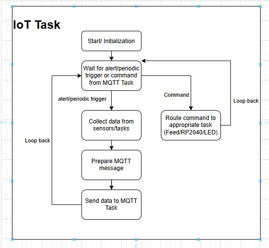
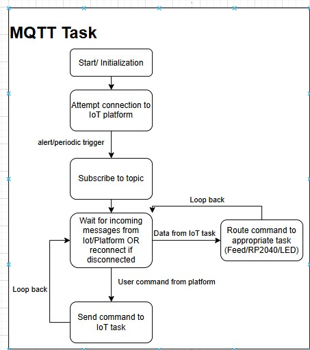
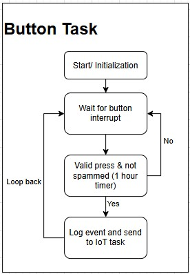
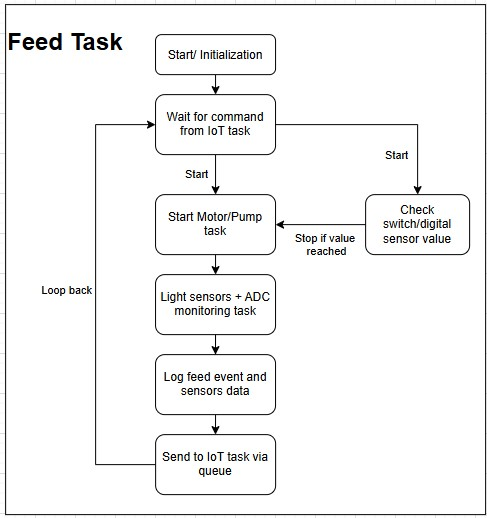
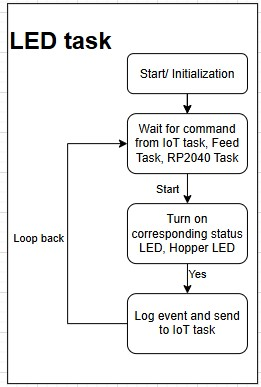
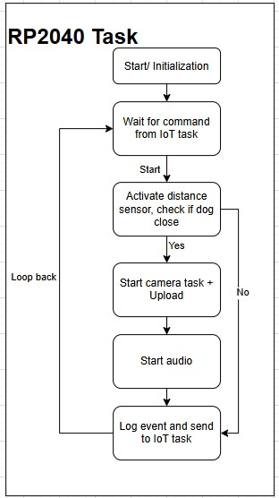
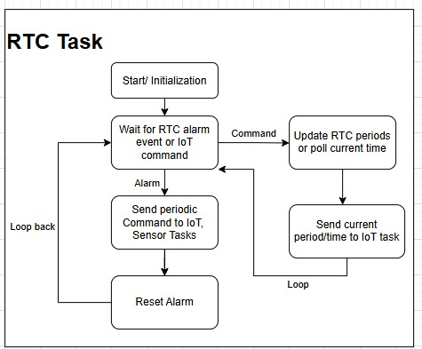
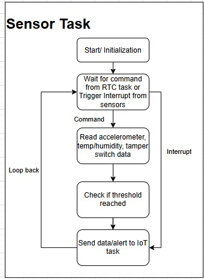
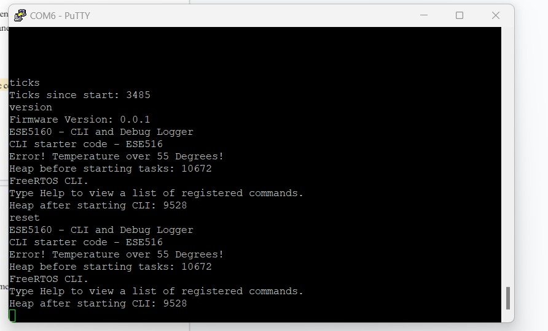

# a07g-exploring-the-CLI

* Team Number: 12
* Team Name: Dogwatch (formerly Andrew and Kiet)
* Team Members: Andrew Katz, Kiet Cao
* GitHub Repository URL: https://github.com/ese5160/final-project-a07g-a14g-t12-andrew-and-kiet
* Description of test hardware: (development boards, sensors, actuators, laptop + OS, etc)

# 1. **Software Architecture**

## Task List (SAMW25)

* CLI:

  * Priority: 1-2?
  * Run continuously/when UART received
* Dog Request Button, User Button

  * Priority: 4 Medium High
  * Trigger: GPIO Interrupt
  * Send the trigger to queue
  * If valid and not repeated (spam last 30 minutes), start task to send alert to IoT platform
* LED Fading/Status

  * Priority: 1
  * Receive message from other tasks via LED queue, maybe can read global var from mutex periodically
* **Wi-Fi/MQTT**

  * Priority: 5 High
  * Trigger: Always connected, boot at start and reboot if failed connection; wake up if need to send message or received message
  * Maintain queues to receive data from IoT or Feeding task, and can send command to IoT, Feeding task, AV.
  * Access to mutex, peridic update of global variables to send to platform?
* RTC task?

  * Priority: 4
  * Set RTC for timed task initiations
  * Enables/disables tasks based on RTC
* SHT4 Temp/humidity (ref) reading

  * Priority: 1-2
  * Trigger: periodic
  * Send via queue/buffer to IoT task
* **Feed Task**

  * Priority: 5
  * Trigger: Button press, MQTT task command, periodic trigger (RTC)?
  * Coordinate all tasks to feed the dog: Motor task -> till index back, digital sensor trips or timeout -> Start light sensor array and ADC read task -> Log events and send to IoT task
* Motor Task

  * Priority: 4
  * Run food motor until return to index position
  * Run water motor until digital level sensor trips or safety timeout
* ADC Async Task? - Read water level before and after water bowl

  * Priority: 3
* Light Sensor Array

  * Priority: 3
  * Get reference light level
  * If too low, turn on lamp to preset brightness
  * Read 8 sensors via mux
  * Calculate food level
  * Report

**IoT Task**

* Priority: 4
* Triggers: Periodic update ( 30-60 mins), events: tilt, feed, distance
* Gather messages from Periodic Tasks, Feed Task, AV Task
* Sends compiled data to Wi-Fi/MQTT Task for upload.
* Uses queue to collect events, mutex-protected shared data for logs.

**Periodic Sensor Tasks**

* Accelerometer Task

  * Priority: 1
  * Init accelerometer
  * Setup interrupt
  * If interrupt fires, send to IoT task
* HDC3022

  * Priority: 1
  * Temp/humidity food reading
  * Periodic update to IoT task
* Tamper Switch

  * Priority: 1
  * Trigger: inerrupt
  * Add owner detect or something (key bypass?)
  * After refill, trigger light sensor array task to re-measure food
  * If tamper switch activates otherwise, then send alert.
  * Alternate: Use thumb screws so dog cannot get in, use tamper switch as trigger for re-measure food
* **Distance Sensor task**

  * Priority: 3
  * Trigger: Command from MQTT, after Feed task?
  * Initialize distance sensor
  * Read distance
  * Interrupt pin checks
  * Init AV Board camera trigger, possibly light trigger
* AV Board Communication (triggered task?)

  * Priority: 3
  * Trigger: Distance sensor task
  * Send UART trigger to RP board

## RP2040 Tasks (Round robin?)

* Wait for UART Triggers
* Get reference light measurement
* Take snapshot, upload to cloud
* LED Control
* Play Audio

#### 1. **Hardware and Software Requirements Specification**

# Hardware Requirement Specification

Microcontroller Unit (MCU)

* HRS 01 - The SAMD21 microcontroller shall be the primary processing unit. The Wi-Fi WINC1500 network controller shall be used for IoT connectivity.
* HRS 02 - The SAMD21 and WINC1500 shall be used in the combined ATSAMW25 module

Sensors

* HRS 03 - An analog water level sensor shall be used to monitor the height of water in the tank with an accuracy of ±5%.
* HRS 04 – A float level sensor (digital) shall be used to detect the presence or absence of water in the pet’s drinking bowl.
* HRS 05 -  A distance sensor shall be used to detect the presence of the pet. The sensor shall measure distance with a range of 1 meter and accuracy of ±10%
* HRS 06 - An array of up to 8 light sensors shall be used to monitor food levels at incremental levels. Each sensor shall measure values that can differentiate if food is covering it or not.
* HRS 07 - An I2C mux/switch shall be used to sample all light sensors output.
* HRS 08 - An LED driver shall be utilized to operate the LED in the hopper. The LED shall have enough brightness for easy differentiation of light sensor values.
* HRS 09 - An ADC mux shall be used to sample all reflective sensors output.
* HRS 10 - An accelerometer shall be used to detect any significant tipping or tilting of the device.
* HRS 11 - A position switch (magnetic sensor or switch) shall be used to accurately check for one full rotation of the motor.
* HRS 12 - A tamper switch (magnetic sensor or switch) shall be used to check for lid opening events.
  Actuators:
* HRS 13 - One motor shall be used to perform a rotation of the dispensing mechanism. The motor shall have enough torque to move the mechanism
* HRS 14 - One Peristaltic Liquid Pump shall be used to pump the water from the tank to the dog food while guaranteeing food safety.
* HRS 15 - One motor driver shall be used to control the direction and torque for the motor and pump
* HRS 16 - An RTC module shall be used to trigger peridiodic tasks

Power:

* HRS 17 - The system shall draw power from one power jack with power regulation for the MCU, power rails for motor/pumps, and peripherals and option to use USB-PD to power. One simple switch shall be used to turn on the system.

Additional features:

* HRS 18 - A dog request button shall be used for the dog (trained) to press on to request food. The button shall have a diameter of 100mm to make it easy to press
* HRS 19 - A camera module shall take a picture of the dog, controlled by RP2040.
* HRS 20 - An audio module including RP2040, amplifier, speaker shall be used to play the recorded audio such as calling the dog.

# Software Requirement Specification

*If not  otherwise stated, each SRS shall be prefixed with "The System/Task Shall*  
**If diagram and wording disagree, diagram takes precidence**  

#### SRS-01: Device Initialization

* Upon power-up, initializes all sensor and actuator tasks.
* Establishes secure Wi-Fi connection within 60 seconds using the Wi-Fi Task.

#### Monitoring & Status Detection

##### SRS-02: Dog Presence Detection

* The distance sensor shall be activated as necessary by the relavant tasks. It shall operate with an interrupt.
* The distance sensor may be polled (if necessary by another task), or an additional task may be written to poll it if necessary
* Monitors distance to detect dog presence within 20 cm.
* Sends presence status to the IoT Reporting Task.
* Triggers Camera Task if dog is detected, via passing message to feeding task

##### SRS-03: Food Level Monitoring

* The system shall compare light sensors meaurements to determine the  food presence at five sensor positions corresponding to levels (20%, 40%, 60%, 80%, and 100%).
* If neccissary, the system shall enable the lights via the AV board for an accurate reading
* The system shall update the queue to IoT task with the food level every hour (or at a rate perscribed by the designers).
* If the food level falls below  20%, the system shall send an alert to the IoT task.
* LED3 (Red) shall turn ON when the food level is below  20% .

##### SRS-04: Water Level Monitoring**

* The system shall read tank volume using analog sensor via ADC Task.
* The system shall send status to IoT Task.
* If tank level < 20%, triggers LED3 (Red) and sends alert to IoT task.
* If Bowl level is low, the system shall trigger the necessary task to refill it.

##### SRS-05: Tilt Detection & Device Stability

* The systemn shall trigger an alert via interrupt and notify IoT Task when exceeding threshold.

##### SRS-06: Temperature & Humidity

* The system shall periodically monitor temperature and humidity and update to IoT task queue
* The system shall monitor food condition and external enviornment condition

#### Dispensing & User Interaction

##### SRS-07: Feed Task

* The task shall coordinate food dispensing.
* The task shall receive commands from MQTT or RTC Task.
* The task shall wait for motor rotation completion via switch feedback, with NMI
* Sends start command to food/water monitoring task

##### SRS-08: Pump

* The system shall activate pump motor to fill water bowl.
* The system Shall Stop pump based on float sensor input or timeout.

##### SRS-09: Motor

* Rotates feeder motor one full turn upon command.
* Uses limit/magnetic switch to detect full rotation.
* Use an NMI for safety

##### SRS-10: RTC task interrupt

* Manages scheduled events (sensors, monitoring, IoT).
* Triggers tasks using FreeRTOS notifications.
* Maintains ±5-60 sec accuracy for schedule execution.

##### SRS-11: LED

* Controls status LEDs (Green, Red).
* Responds to commands from other tasks (IoT/Food Monitoring).

##### SRS-11:Dog Request Button for Communication

* Handles input from dog or user button.
* Debounces and limits presses to 1 per 20 minutes.
* Sends alerts to IoT Reporting Task.

##### SRS-12: Camera Monitoring & Pet Image Capture

* Commands a secondary MCU to capture pet image.
* Triggered by Distance Sensor Task or MQTT command.
* Sends image to platform.

##### SRS-14: Audio**

* Plays pre-recorded clips to call dog during scheduled or command-driven events.
* Triggered by Feed or IoT Task.

##### SRS-15: Tamper Switch

* Detects hopper lid removal via.
* Sends alert to IoT Task.
* Triggers re-measurement of food level via Light Sensor Task.

#### Communication & Data Handling

**SRS-15:
MQTT**

* Connects to the IoT platform using WINC1500.
* Manages subscriptions and publishes via MQTT/HTTP.
* Reconnects automatically if disconnected.

**SRS-16:
IoT**

* Collects and logs system data from all monitoring and control tasks.
* Sends updates every 20 minutes or when an event occurs.
* Logs data including food/water events, dog presence, tilt, and battery.
* Sends notifications to platform.
* Receive command from platform and activate tasks correpondingly

**SRS-15:
Data Logging & Storage**

* The platform shall  log events , including:

  * Feeding times
  * Water refills
  * Dog presence detection
  * Device tilt alerts

**SRS-16:
Security & Data Encryption**

* The system shall implement secure authentication mechanisms for accessing the IoT platform.
* All data transmissions shall be encrypted using AES or DES to prevent unauthorized access.

#### 2. Block Diagram



Detailed Tasks in Software Block Diagram

### 3. Flowchart

















# 2. **Understanding the Starter Code**

**Answer the following questions:

1. What does “InitializeSerialConsole()” do? In said function, what is “cbufRx” and “cbufTx”? What type of data structure is it?
   InitializeSerialConsole():

   * Initializes circular buffers `cbufRx` and `cbufTx` for RX and TX using `circular_buf_init()`.
   * Configures the UART (SERCOM) to 115200 baud and enable UART instance.
   * Sets up `usart_read_callback()` and `usart_write_callback()` to handle asynchronous read/write.
   * Set the interrupt priority of the SERCOM used for UART to SERCOM 4.
   * Starts the first non-blocking UART read.

   cbuf_handle_t cbufRx is Circular buffer handler for receiving characters.
   cbuf_handle_t cbufTx is Circular buffer handler for transmitting characters.

   It points to the circular buffer cbuf (fixed size array) with functions such as size, free, put, get.
2. How are “cbufRx” and “cbufTx” initialized? Where is the library that defines them (please list the *C file they come from).

   circular_buf_init()  returns a cbuf_handle_t, which is a pointer to a dynamically allocated circular_buf_t structure with size and buffer defined.

   These handles (cbufRx, cbufTx) are then used to interact with the buffer through the circular buffer API.

   They come from the circular_buffer.c file
3. Where are the character arrays where the RX and TX characters are being stored at the end? Please mention their name and size.

   1. Tip: Please note cBufRx and cBufTx are structures.
      The character data is actually stored in rxCharacterBuffer[RX_BUFFER_SIZE] and  txCharacterBuffer[TX_BUFFER_SIZE] with size defined to be 512 for both
4. Where are the interrupts for UART character received and UART character sent defined?

   The UART character received and sent interrupts are set up in `configure_usart_callbacks()` function. The `usart_read_callback()` is registered and enabled for `USART_CALLBACK_BUFFER_RECEIVED`. Similarly, `usart_write_callback()` is registered and enabled for `USART_CALLBACK_BUFFER_TRANSMITTED`.
5. What are the callback functions that are called when:
6. A character is received? (RX)

   usart_read_callback()
7. A character has been sent? (TX)

   usart_write_callback()
8. Explain what is being done on each of these two callbacks and how they relate to the cbufRx and cbufTx buffers.

   usart_read_callback(): once the system finishes receives all the bytes requested from a UART read job, put the character from lastestRx to rxCharacterBuffer, and start new read job.

   usart_write_callback(): Gets the next character from `cbufTx` using `circular_buf_get()` and if still need to write then starts a new write job.
9. Draw a diagram that explains the program flow for UART receive – starting with the user typing a character and ending with how that characters ends up in the circular buffer “cbufRx”. Please make reference to specific functions in the starter code.


10. Draw a diagram that explains the program flow for the UART transmission – starting from a string added by the program to the circular buffer “cbufTx” and ending on characters being shown on the screen of a PC (On Teraterm, for example). Please make reference to specific functions in the starter code.


11. What is done on the function “startStasks()” in main.c? How many threads are started?
Prints available heap size before start, then create the CLI task/thread, and print heap size after the CLI created.
One thread (CLI) currently.

**

# 3. Debug Logger Module

```c
/**
 * @brief Logs a formatted message to the serial console if the message level
 *        is equal to or above the current log level.
 *
 * @param level  The level of the message (e.g., LOG_INFO_LVL, LOG_ERROR_LVL).
 * @param format A format string.
 * @param ...    Variable arguments corresponding to the format string.
 */
void LogMessage(enum eDebugLogLevels level, const char *format, ...)
{
    // Todo: Implement Debug Logger
	// More detailed descriptions are in header file
	// Only send if  log_level above current
 if (level < getLogLevel() || level >= LOG_OFF_LVL)
 {
	 return;
 }

 char messageBuffer[LOG_BUFFER_SIZE];
 va_list args;

 // Initialize the variable argument list
 va_start(args, format);
 // Format the message into Buffer
 vsnprintf(messageBuffer, LOG_BUFFER_SIZE, format, args);
 // Clean up the variable argument list
 va_end(args);
 // Send message to Serial Console
 SerialConsoleWriteString(messageBuffer);
}
```

Module updated as in code block

Serial Monitor result only prints CLI starting and Error line as expected.


# 4. Wiretap the convo!

1. Logic analyzer attached to the TX line
2. Correspondingly it is pin PB10 on Board while PB11 is RX
3. The important setting is: Async Serial Mode (trigger view) with bit rate 115200 (as set in the code), 8 bits per transfer, no parity, 1 stop (8N1 as specified) then convert to ASCII. Below are configuration images (connection + setting) and output result
   

   

   

   Sal file commited at A07GSerial.sal

# 5. Complete the CLI

Code committed and commented

# 6. Add CLI commands

Code committed and commented
Video at A07G_Image\A07G_CLI.mp4

or link: https://drive.google.com/file/d/110afQs4N7KxUkq36dOKfQNsCWN813Ipd/view?usp=sharing

<video controls src="A07G_Image/A07G_CLI.mp4" title="Title"></video>

Screenshot of Terminal:

